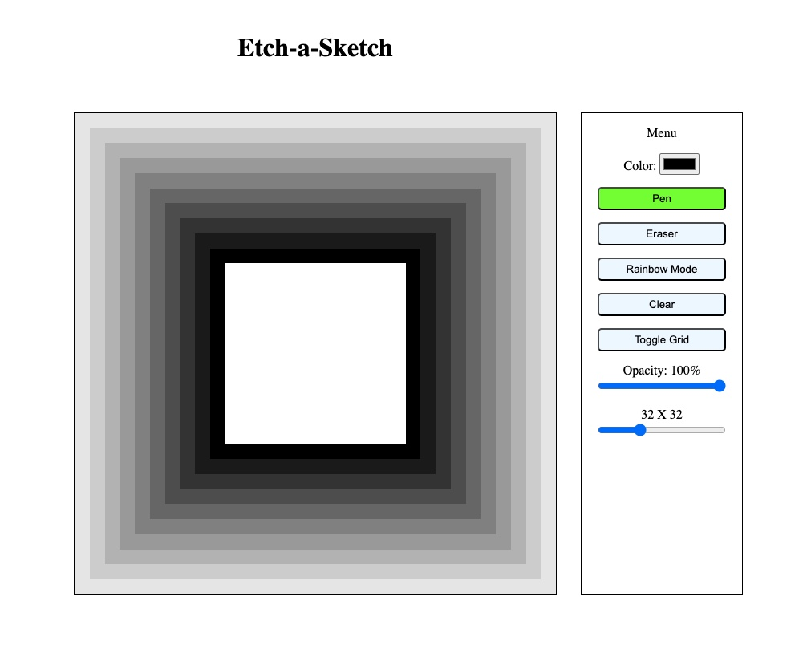
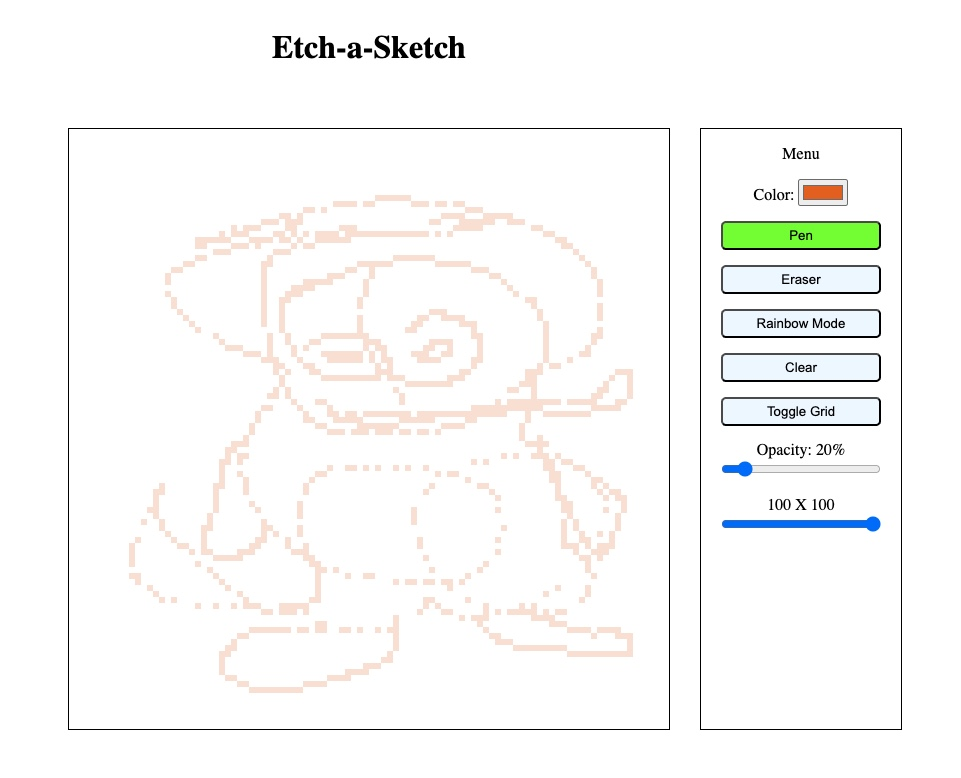

# Etch-a-Sketch

This project is a browser version of something between a sketchpad and an Etch-A-Sketch. You can hold down the mouse and hover over the tiles you want to color, or click individual tiles for more precise control. There are a number of options to choose from, including a RGB color picker, an opacity slider, an option to choose the size of the n x n square grid, an eraser and even an amusing rainbow mode that colors each pixel a random different color.

Here are some examples created with the 

